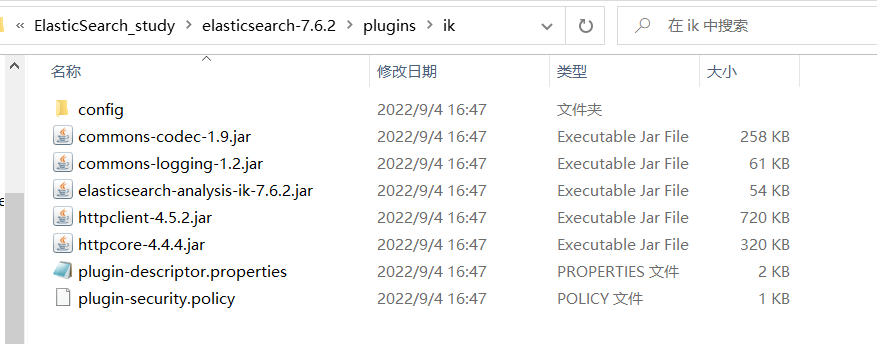
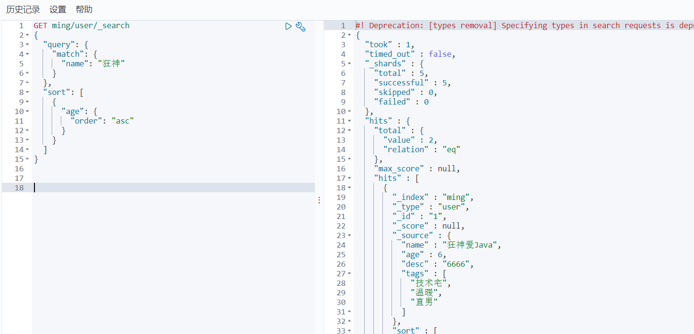
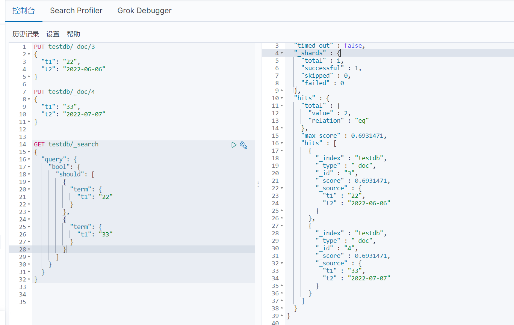

## ES的安装以及head插件安装

ES最低要求：JDK1.8

ES镜像下载地址：

https://mirrors.huaweicloud.com/elasticsearch/?C=N&O=D

#### **熟悉目录**


```
bin 启动文件
config 配置文件
	log4j2.properties 日志配置文件
	jvm.options java虚拟机相关配置
	elasticsearch.yml 	elasticsearch 的配置文件 默认是9200端口 跨域问题也在这里设置
lib 相关jar包
logs 日志！
modules 功能模块
plugins 插件！ ik
```

#### 启动


双击bin目录下的	`elasticsearch.bat`


**访问测试：127.0.0.1:9200**


#### head的安装

下载地址：https://github.com/mobz/elasticsearch-head/archive/master.zip

注意：这里需要node环境

node与npm版本匹配：https://nodejs.org/zh-cn/download/releases/

下载解压后，进入主要目录cmd内输入

```
npm install //下载对应依赖
```


```
npm run start //启动head
```


访问9100 出现跨域问题：


**解决跨域问题：**

在elasticsearch 配置文件中配置


```
http.cors.enabled: true
http.cors.allow-origin: "*"
```

**访问测试**


## 了解ELK

​	ELK是Elasticsearch、Logstash、Kibana 三大开源框架首字母大写简称。市面上也被称为Elastic Stack。其中Elasticsearch是一个基于Lucene、分布式、通过Restful方式进行交互的近实时搜索平台框架。像类似百度、谷歌这种大数据全文搜索引擎的场景都可以使用Elasticsearch作为底层支持框架，可见Elasticsearch提供的搜索能力确实强大，市面上很多时候我们简称Elasticsearch为ES。Logstash是ELK的中央数据流引擎，用于从不同目标（文件/数据存储/MQ）收集的不同格式数据，经过过滤后支持输出到不同目的地（文件/MQ/redis/elasticsearch/kafka等）。Kibana可以将elasticsearch的数据通过友好的页面展示处理，提供实时分析的功能。

​	市面上很多开发只要提到ELK能够一致说出它是一个日志分析架构技术总称，但实际上ELK不仅仅适用于日志分析，它还可以支持其他任何数据分析和收集的场景，日志分析和收集只是更具有代表性，并非一致性。


## Kibana的安装

**什么是Kibana?**

=>	Kibana是一个数据分析和可视化平台，通常与Elasticsearch配合使用，用于对其中的数据进行搜索、分析，并且以统计图标的形式展示。

官网：https://www.elastic.co/cn/kibana

Kibana版本要和es一致

下载地址：https://mirrors.huaweicloud.com/kibana/?C=N&O=D

**解压后启动测试=>**


汉化修改：

在kibana.yml中修改

```
i18n.locale: "zh-CN"
```


## ES核心概念

=>	集群、节点、索引、类型、文档、分片、映射？

Elasticsearch是面向文档


关系型数据库与elasticsearch 的对比

| Relational DB    | Elasticsearch |
| ---------------- | ------------- |
| 数据库(database) | 索引(indices) |
| 表(tables)       | types         |
| 行(rows)         | documents     |
| 字段(columns)    | fields        |

elasticsearch(集群)中可以包含多个索引(数据库)，每个索引中可以包含多个类型(表)，每个类型下又包含多个文档(行)，每个文档中又包含多个字段(列)

**物理设计**

elasticsearch在后台把每个**索引划分成多个分片**，每份分片可以在集群中的不同服务迁移。

一个人就是一个集群!	默认的集群名称就是elaticsearch


**逻辑设计**

一个索引类型中，包含多个文档，比如文档1、文档2。当我们索引一篇文章时可以通过这样的一个顺序找到它：索引->类型->文档ID，通过这个组合我们就能索引到某个具体的文档。

注意：ID不必是整数，实际上它是个字符串

**文档**

​	=>之前说elasticsearch是面向文档的,那么意味着索引和搜索数据的最小单位是文档,elasticsearch中,文档有几个重要属性:

- 自我包含,一篇文档同时包含字段和对应的值,也就是同时包含key:value
- 可以是层次型的,一个文档中包含自文档,复杂的逻辑实体就是这么来的!
- 灵活的结构,文档不依赖先定义的模式,我们知道关系型数据库中,要提前定义字段才能使用,在elasticsearch中,对于字段是非常灵活的,有时候,我们可以忽略该字段,或者动态的添加一个新的字段.

尽管我们可以随意的新增或者忽略某个字段,但是每个字段的类型非常重要,比如一个年龄字段类型,可以是字符串 也可以是整型。因为elasticsearch会保存字段和类型之间的映射及其他的设置。这种映射具体到每个映射的每种类型，这也是为什么在elasticsearch中，类型有时候也称为映射类型。

**类型**

=> 类型是文档的逻辑容器，就像关系型数据库一样，表格是行的容器。类型中对于字段的定义称为映射，比如name映射为字符串类型。我们说文档是无模式的，它们不需要拥有映射中所定义的所有字段，比如新增一个字段，那么elasticsearch是怎么做的呢？elasticsearch会自动的将新字段加入映射，但是这个字段的不确定它是什么类型，elasticsearch就开始猜，如果这个值是18，那么elasticsearch会认为它是整型。但是elasticsearch也可能猜不对，所以最安全的方式就是提前定义好所需要的映射，这点跟关系型数据库殊途同归了，先定义好字段，然后再使用。

**索引**

就是数据库！

索引是映射类型的容器，elasticsearch中的索引是一个非常大的文档集合。索引存储了映射类型的字段和其他设置。然后它们被存储到了各个分片上了。我们来研究下分片是如何工作的。

**物理设计 ：节点和分片如何工作	=>**

一个集群至少有一个节点，而一个节点就是一个elasticsearch进程，节点可以有多个索引默认的，如果你创建索引，那么索引将会有5个分片(primary shard，又称主分片)构成的，每一个主分片会有一个副本（replica shard,又称复制分片）


上图是一个有3个节点的集群，可以看到主分片和对应的复制分片都不会在同一个节点内，这样有利于某个节点挂掉了，数据也不至于丢失。实际上，一个分片是一个Lucene索引，一个包含倒排索引的文件目录，倒排索引的结构使得elasticsearch在不扫描全部文档的情况下，就能告诉你哪些文档包含特定的关键字。

**倒排索引？**

=>	elasticsearch使用的是一种称为倒排索引的结构，采用Lucene倒排索引作为底层。这种结构适用于快速的全文搜索，一个索引由文档中所有不重复的列表构成，对于每一个词，都有包含他的文档列表。

例如，现在有两个文档：

```bash
Study every day, good good up to forever # 文档1包含的内容
To forver, study every day, good good up # 文档2包含的内容
```

为了创建倒排索引，我们首先要将每个文档拆分成独立的词（或称为词条或者tokens）,然后创建一个包含所有不重复的词条的排序列表，然后列出每个词条出现在那个文档：

| term    | doc_1 | doc_2 |
| ------- | ----- | ----- |
| Study   | √     | ×     |
| To      | ×     | ×     |
| every   | √     | √     |
| forever | √     | √     |
| day     | √     | √     |
| study   | ×     | √     |
| good    | √     | √     |
| every   | √     | √     |
| to      | √     | ×     |
| up      | √     | √     |

试图搜索to forver,只需要查看包含每个词条的文档

| term    | doc_1 | doc_2 |
| ------- | ----- | ----- |
| to      | √     | ×     |
| forever | √     | √     |
| total   | 2     | 1     |

两个文档都匹配，但是第一个文档比第二个匹配度更高。如果没有别的条件，现在这两个关键字的文档都将返回。


如果要搜索含有python标签的文章，那相对于查找所有原始数据而言，查找倒排索引的数据将会快的多。只需要查看标签这一栏，然后获取相关文章ID即可。

> 在elsticsearch中，索引被分为多个分片，每份 分片是一个Lucene的索引。所以一个elasticsearch索引是由多个Lucene索引组成的。

## IK分词器插件

=>

分词：即把一段中文或者别的划分成一个个的关键字，我们在搜索时候时候会把自己的信息进行分词，会把数据库中或者索引库中的数据进行分词，然后进行一个匹配操作，默认的中文分词器是将每个字看成一个词，例如"你好啊"会被分为"你"，"好"，"啊"。但这样不符合要求，所以需要中文分词器ik来解决。

如果使用中文，建议使用ik分词器

IK提供了两个分词算法：ik_smart和ik_max_word，其中ik_smart为最少切分，ik_max_word为最细粒度划分！

**安装**

下载地址：https://github.com/medcl/elasticsearch-analysis-ik/releases

下载完成后解压放入es的plugins中



重启ES即可


elasticsearc-plugin list可以通过这个命令来查看加载进来的插件


**使用Kibana测试**

查看不同的分词效果

- ik_smart


- ik_max_word


**如果需要自己的词，就需要加到字典中**


重启ES测试：


发现刚刚加入的词”狂神“已经加入了字典


## Rest风格说明

| method | url地址                                         | 描述                   |
| ------ | ----------------------------------------------- | ---------------------- |
| PUT    | localhost:9200/索引名称/类型名称/文档id         | 创建文档（指定文档id） |
| POST   | localhost:9200/索引名称/类型名称                | 创建文档（随机文档id） |
| POST   | localhost:9200/索引名称/类型名称/文档id/_update | 修改文档               |
| DELETE | localhost:9200/索引名称/类型名称/文档id         | 删除文档               |
| GET    | localhost:9200/索引名称/类型名称/文档id         | 查询文档通过文档id     |
| POST   | localhost:9200/索引名称/类型名称/_search        | 查询所有数据           |

#### 索引基础操作测试

1、创建一个索引

```
PUT /索引名/~类型名~/文档id
{请求体}
```


完成了自动增加了索引，数据也成功添加了

**数据类型**

- 字符串类型

  text、keyword

- 数值类型

  long,integer,short,byte,double,float,half float,scaled float

- 日期类型

  date

- 布尔值类型

  boolean

- 二进制类型

  binary

- .....

2、指定字段类型创建索引


3、通过GET请求获得具体的信息


4、查看默认的信息


如果自己的文档字段没有指定，那么es就会给我们默认配置字段类型

5、通过命令elasticsearch索引情况


```
GET _cat/....
```

6、修改索引

覆盖的方式：


更新的方式：


7、删除索引


通过DELETE命令实现删除对应的索引或文档记录。


#### 文档的基础操作

1、添加数据

```
PUT /ming/user/1
{
  "name": "ming",
  "age": 6,
  "desc": "6666",
  "tags": ["技术宅","温暖","直男"]
}
```


2、获取数据

```
GET ming/user/1
```


3、更新数据 		PUT


4、POST 更新数据（现在推荐使用这种更新方式）

```
POST /ming/user/1/_update
{
  "doc":{
    "name": "ming爱Java"
  }
}
```


**注意：记得在后面加上/_update** ，否则其他没有修改或设置的数据将会被设为空值

##### **搜索操作**

1、简单的搜索操作

```
GET ming/user/1
```

2、简单的条件查询

```
GET ming/user/_search?q=name:ming爱java
```


简单的条件查询，可以根据默认的映射规则，产生基本的查询

3、复杂的操作查询 select (排序、分页、高亮、模糊查询、精准查询)


这里的score为匹配度，如果存在多条查询的数据，这个分值越高则匹配度越高。


**结果过滤查询：**

```
GET ming/user/_search
{
  "query": {
    "match": {
      "name": "狂神"
    }
  },
  "_source": ["name","desc"]
}
```


**排序查询：**

```
//升序
GET ming/user/_search
{
  "query": {
    "match": {
      "name": "狂神"
    }
  },
  "sort": [
    {
      "age": {
        "order": "desc"
      }
    }
  ]
}
//降序
GET ming/user/_search
{
  "query": {
    "match": {
      "name": "狂神"
    }
  },
  "sort": [
    {
      "age": {
        "order": "asc"
      }
    }
  ]
}
```



**分页查询：**

```
GET ming/user/_search
{
  "query": {
    "match": {
      "name": "狂神"
    }
  },
  "sort": [
    {
      "age": {
        "order": "asc"
      }
    }
  ],
  "from": 0,
  "size": 1
}
```


注意：数据下标从0开始

前端接受请求？=> /search/{current}/{pagesize}

**布尔值查询：**

多条件查询 must


多条件查询 or


must_not


**过滤器**

=> 使用filter 进行数据过滤


- gt 大于
- gte 大于等于
- lt 小于
- lte 小于等于

**匹配多个条件查询**


**精确查询**

=> term 查询直接通过倒排索引指定的词条进行精确的查找

- term，直接查询精确的
- match,会使用分词器解析！（先分析文档，然后通过分析的文档进行查询）


**keyword 字段不会被分词器解析！**

**多个值匹配精度查询**


```
GET testdb/_search
{
  "query": {
    "bool": {
      "should": [
        {
          "term": {
            "t1": "22"
          }
        },
        {
          "term": {
            "t1": "33"
          }
        }
      ]
    }
  }
}
```



**高亮查询**

```
GET ming/user/_search
{
  "query": {
    "match": {
      "name": "张三"
    }
  },
  "highlight": {
    "fields": {
      "name": {}
    }
  }
}
```


自定义高亮：


## 集成SpringBoot


文档地址：https://www.elastic.co/guide/index.html


Elasticsearch Clients

https://www.elastic.co/guide/en/elasticsearch/client/index.html


这里我们一般使用Java REST Client

一般选择高级客户端

文档地址：

https://www.elastic.co/guide/en/elasticsearch/client/java-rest/7.6/java-rest-high-compatibility.html


**原生依赖**

```xml
<dependency>
    <groupId>org.elasticsearch.client</groupId>
    <artifactId>elasticsearch-rest-high-level-client</artifactId>
    <version>7.6.2</version>
</dependency>
```


**对象的初始化**


**这个类中的基本方法**


#### 配置springboot

问题1：注意springboot自动导入的es依赖版本要和本地的版本一致


```java
/*
1、找对象
2、放到spring 中待用
3、分析源码
 */
@Configuration
public class ElasticsearchClientConfig {
    @Bean
    public RestHighLevelClient restHighLevelClient(){
        RestHighLevelClient client = new RestHighLevelClient(
                RestClient.builder(
                        new HttpHost("localhost", 9200, "http")));
        return client;
    }
}
```

 

#### API测试

1、创建索引

```java
// 测试索引的创建
    @Test
    void testCreatIndex() throws IOException {
        //1、创建索引请求
        CreateIndexRequest request = new CreateIndexRequest("ming_index");
        //2、客户端执行请求 indicesClient
        CreateIndexResponse createIndexResponse = restHighLevelClient.indices().create(request, RequestOptions.DEFAULT);
        System.out.println(createIndexResponse);
    }
```


2、判断索引是否存在

```java
    //测试获取索引
    @Test
    void testExistIndex() throws IOException {
        GetIndexRequest request = new GetIndexRequest("ming_index");
        boolean exists = restHighLevelClient.indices().exists(request, RequestOptions.DEFAULT);
        System.out.println(exists);

    }
```


3、删除索引

```java
    //测试删除索引
    @Test
    void testDeleteIndex() throws IOException {
        DeleteIndexRequest request = new DeleteIndexRequest("ming_index");
        AcknowledgedResponse response = restHighLevelClient.indices().delete(request, RequestOptions.DEFAULT);
        System.out.println(response);
    }
```


4、CRUD文档

**创建文档**

```java
 @Test
    void testAddDocument() throws IOException {
        //创建对象
        User user = new User("ming",3);
        //创建请求
        IndexRequest request = new IndexRequest("ming_index");
        // 规则 put /ming_index/_doc/1
        request.id("1");
        request.timeout(TimeValue.timeValueSeconds(1));
        request.timeout("1s");
        //将我们的数据放入请求 json
        request.source(JSON.toJSONString(user), XContentType.JSON);
        //客户端发送请求
        IndexResponse index = restHighLevelClient.index(request, RequestOptions.DEFAULT);
        System.out.println(index.toString());
        System.out.println(index.status());

    }
```


**查询文档是否存在**

```java
  //获取文档判断是否存在
    @Test
    void testIsExistsDocument() throws IOException {
        GetRequest getRequest = new GetRequest("ming_index", "1");
        //不获取返回的 _source的上下文
        getRequest.fetchSourceContext(new FetchSourceContext(false));
        getRequest.storedFields("_none_");
        boolean exists = restHighLevelClient.exists(getRequest, RequestOptions.DEFAULT);
        System.out.println(exists);

    }
```

**查询文档信息**

```java
    //获取文档信息
    @Test
    void testGetDocument() throws IOException {
        GetRequest getRequest = new GetRequest("ming_index", "1");
        GetResponse getResponse = restHighLevelClient.get(getRequest, RequestOptions.DEFAULT);
        System.out.println(getResponse.getSourceAsString());//打印文档内容
        System.out.println(getResponse); //返回的全部内容和命令式一样的
    }
```

**更新文档的信息**

```java
//更新文档的信息
    @Test
    void testUpdateDocument() throws IOException {
        UpdateRequest updateRequest = new UpdateRequest("ming_index","1");
        updateRequest.timeout("1s");

        User user = new User("ming6", 18);
        updateRequest.doc(JSON.toJSONString(user), XContentType.JSON);

        UpdateResponse updateResponse = restHighLevelClient.update(updateRequest, RequestOptions.DEFAULT);
        System.out.println(updateResponse.status());

    }
```

**删除文档**

```java
@Test
void testDeleteDocument() throws IOException {
    DeleteRequest request = new DeleteRequest("ming_index", "1");
    request.timeout("1s");

    DeleteResponse deleteResponse = restHighLevelClient.delete(request, RequestOptions.DEFAULT);
    System.out.println(deleteResponse.status());
}
```

**批量插入**

```java
    //批量插入数据
    @Test
    void testBulkRequest() throws IOException {
        BulkRequest bulkRequest = new BulkRequest();
        bulkRequest.timeout("10s");
        ArrayList<User> userList = new ArrayList<>();
        userList.add(new User("ming1",3));
        userList.add(new User("ming2",4));
        userList.add(new User("ming3",5));
        userList.add(new User("ming4",6));
        userList.add(new User("ming5",7));
        userList.add(new User("ming6",8));
        //批处理请求
        for (int i = 0; i < userList.size(); i++){
            // 批量更新和批量删除，就在这里修改对应请求即可
            bulkRequest.add(
                    new IndexRequest("ming_index")
                            .id(""+(i+1))
                            .source(JSON.toJSONString(userList.get(i)),XContentType.JSON)
            );
        }
        BulkResponse bulk = restHighLevelClient.bulk(bulkRequest, RequestOptions.DEFAULT);
        System.out.println(bulk.hasFailures());
    }
```

**查询操作**

```java
    //查询
    //SearchRequest 搜索请求
    //SearchSourceBuilder 条件构造
    //HighlightBuilder 构建高亮
    //TermQueryBuilder 精确查询
    //MatchAllQueryBuilder 匹配所有
    @Test
    void testSearch() throws IOException {
        SearchRequest searchRequest = new SearchRequest("ming_index");
        //构建搜索条件 ？高亮、排序、...
        SearchSourceBuilder sourceBuilder = new SearchSourceBuilder();
        //查询条件  可以使用QueryBuilders 工具类来快速实现
        //QueryBuilders.termQuery 精确匹配
        //QueryBuilders.matchAllQuery 匹配所有
        TermQueryBuilder termQueryBuilder = QueryBuilders.termQuery("name", "ming1");

        sourceBuilder.query(termQueryBuilder);
//        sourceBuilder.from(); 分页
//        sourceBuilder.size();
        sourceBuilder.timeout(new TimeValue(60, TimeUnit.SECONDS));

        searchRequest.source(sourceBuilder);

        SearchResponse searchResponse = restHighLevelClient.search(searchRequest, RequestOptions.DEFAULT);
        System.out.println(JSON.toJSONString(searchResponse.getHits()));//所有的信息都在hits中
        System.out.println("===========================");
        for (SearchHit documentFields : searchResponse.getHits().getHits()) {
            System.out.println(documentFields.getSourceAsMap());
        }
    }
```

